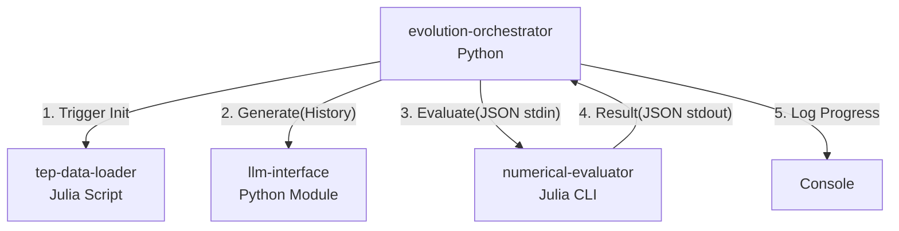

# Design Document

## Overview 
This feature delivers the core execution loop (Orchestrator) for the LLM-GP system. It acts as the central controller that initializes data, manages the evolutionary generations, requests formula mutations from the `llm-interface`, and evaluates them using the `numerical-evaluator`.

### Goals
- Wave 1, Wave 2で構築した各コンポーネントを統合し、エンドツーエンドの進化戦略（EP）ループを自動実行する。
- 世代ごとの履歴管理とエリート（最良個体）の保存を行う。
- 評価結果に基づくLLMへのフィードバックコンテキストを構築する。

### Non-Goals
- LLM API通信自体のリトライ処理（`llm-interface`が担当）
- 数式のASTパースや最適化計算（`numerical-evaluator`が担当）

## Boundary Commitments

### This Spec Owns
- メイン実行ループの進行管理（世代数のインクリメント、終了条件の判定）。
- `HistoryManager`による過去の数式とスコアのメモリ上での状態保持。
- サブプロセス（Julia）の起動、I/Oハンドリング、およびタイムアウト/クラッシュ時のリカバリ制御。
- 標準出力やログファイルへの進捗と最終結果のロギング。

### Out of Boundary
- プロンプトテンプレートの実際のパース処理（`llm-interface`の`PromptManager`に依存）。
- 適応度（Fitness）の計算ロジック。

### Allowed Dependencies
- `llm-interface` (Python module: 内部インポート)
- `numerical-evaluator` (Julia CLI: サブプロセス呼び出し)
- `tep-data-loader` (Julia CLI/Script: サブプロセス呼び出し、初期化用)

### Revalidation Triggers
- `llm-interface` または `numerical-evaluator` のインターフェース（入出力JSONスキーマ、関数シグネチャ）が変更された場合。

## Architecture

### Architecture Pattern & Boundary Map
Pythonをホストとする **Controller Pattern** を採用。



### Technology Stack

| Layer | Choice / Version | Role in Feature | Notes |
|-------|------------------|-----------------|-------|
| Controller | Python 3.10+ | メインループ制御 | |
| Process Mgmt | `subprocess` (標準) | Julia CLIの呼び出し | |
| Logging | `logging` (標準) | コンソールおよびファイル出力 | |
| Data | `dataclasses` / `json` | 履歴保持、プロセス間通信 | |

## File Structure Plan

```text
src/orchestrator/
├── __init__.py
├── main.py            # CLIエントリポイント、全体フローの結合
├── loop.py            # EvolutionLoopクラス（世代管理、収束判定）
├── history.py         # HistoryManagerクラス（エリート保持、履歴追跡）
└── julia_runner.py    # SubprocessWrapperクラス（Julia呼び出し、JSON I/O隠蔽）
```

## Requirements Traceability

| Requirement | Summary | Components | Interfaces |
|-------------|---------|------------|------------|
| 1.1, 1.2 | システム初期化とデータ準備 | `julia_runner.py`, `main.py` | `init_data()` |
| 2.1, 2.2, 2.3 | 進化ループ制御とエリート保持 | `loop.py`, `history.py` | `run_evolution()`, `record()` |
| 3.1, 3.2, 3.3 | LLMとJuliaの連携（JSON I/O等） | `julia_runner.py`, `loop.py` | `evaluate_formula()` |
| 4.1, 4.2 | 結果出力とロギング | main.py, loop.py | logger.info() |
| 5.1 | インタラクティブモード引数の解釈 | main.py | `argparse` | | `main.py`, `loop.py` | `logger.info()` |

## Components and Interfaces

### Orchestrator Core

#### EvolutionLoop (`loop.py`)
| Field | Detail |
|-------|--------|
| Intent | 進化の世代を管理し、生成・評価・フィードバックのサイクルを回す |
| Requirements | 2.1, 2.3, 3.2, 3.3, 4.1 |

**Dependencies**
- External: `llm-interface.LLMFacade` (P0)
- Outbound: `SubprocessWrapper` (P0), `HistoryManager` (P0)

##### Service Interface
```python
class EvolutionLoop:
    def __init__(self, llm: LLMFacade, evaluator: SubprocessWrapper, history: HistoryManager):
        pass
        
    def run(self, max_generations: int, target_rmse: float) -> EvolutionResult:
        # Loop implementation
        pass
```

#### HistoryManager (`history.py`)
| Field | Detail |
|-------|--------|
| Intent | 世代ごとの評価結果を記録し、最良個体（エリート）やLLMへのコンテキストを提供する |
| Requirements | 2.2, 3.2 |

##### Service Interface
```python
@dataclass
class GenerationRecord:
    generation: int
    formula: str
    fitness: float
    rmse: float
    coefficients: list[float]
    reasoning: str

class HistoryManager:
    def add_record(self, record: GenerationRecord) -> None:
        pass
    def get_best(self) -> GenerationRecord | None:
        pass
    def get_context_for_llm(self) -> dict:
        # Returns formatted history for PromptManager
        pass
```

#### SubprocessWrapper (`julia_runner.py`)
| Field | Detail |
|-------|--------|
| Intent | Juliaプロセスを安全に呼び出し、JSONの入出力をパースする |
| Requirements | 1.1, 1.2, 3.1 |

**Responsibilities & Constraints**
- Juliaプロセスのハングを防ぐためのタイムアウト機構。
- `stderr` のキャプチャとログ出力（デバッグ用）。

##### Service Interface
```python
class SubprocessWrapper:
    def init_data(self) -> bool:
        # Calls tep-data-loader script
        pass
        
    def evaluate_formula(self, formula: str, target_var: str) -> dict:
        # Spawns numerical-evaluator CLI, sends JSON to stdin, parses stdout JSON
        # Throws EvaluationError on timeout or Julia error exit
        pass
```

## Error Handling

### Error Strategy
- **Julia Crash / Timeout**: `SubprocessWrapper` が例外をキャッチし、その個体のFitnessをワースト（Infなど）として記録してループを継続する（進化を止めない）。
- **Data Init Failure**: 初期化失敗は致命的であるため、ループを開始せずに直ちにスクリプトを異常終了（Exit 1）させる。

## Testing Strategy
- Unit Tests:
  - `history.py`: レコードの追加、ベスト個体の正しい更新ロジックの確認。
  - `julia_runner.py`: Python組み込みのダミースクリプトを呼び出し、標準入力へのJSON書き込みと標準出力からのJSON読み込み、タイムアウト動作をモックテストする。
- Integration Tests:
  - `loop.py`: モック化された `LLMFacade` と `SubprocessWrapper` を用いて、指定した世代数でループが停止すること、および目標RMSE達成時に早期終了（ブレイク）することを確認する。
