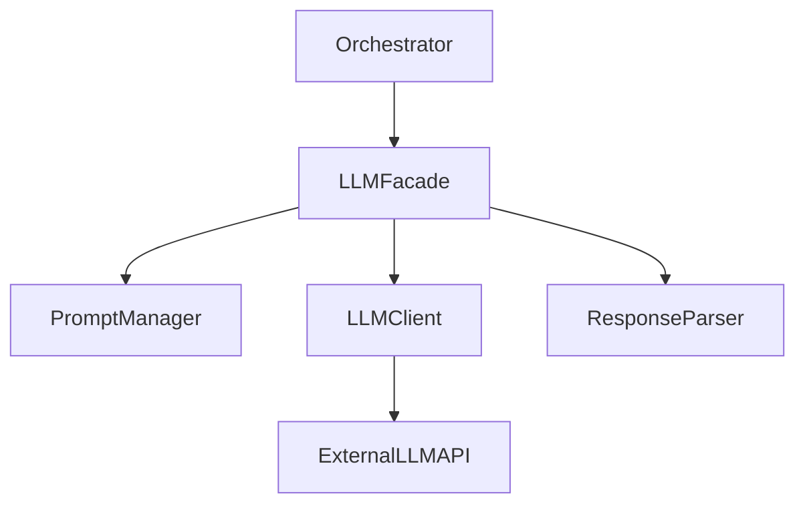
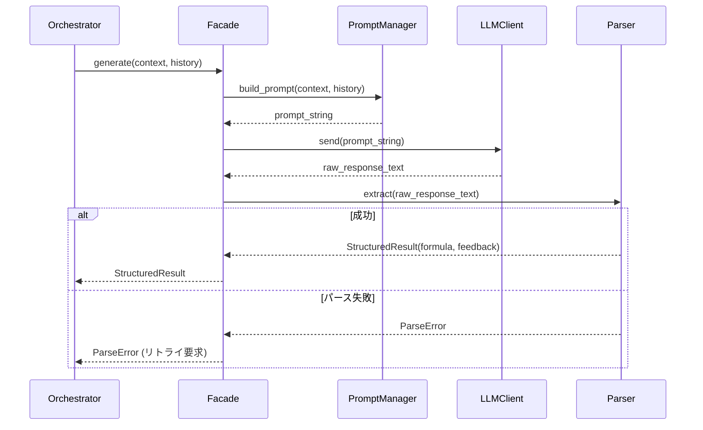

# Technical Design

## Overview
**Purpose**: 本機能は、LLM-GPシステムにおけるLLMとのインターフェースを提供し、進化戦略プロンプトの送信と結果（数式およびフィードバック）の抽出を実現する。
**Users**: システムのメインループ（進化オーケストレーター）が本モジュールを利用してLLMと対話する。
**Impact**: これにより、LLMを用いた記号回帰の探索ループがシステム内で自動実行可能になる。

### Goals
- 動的なプロンプト変数の埋め込みとプロンプト管理
- LLM APIへの確実なリクエスト送信とエラー時のリトライ機構の提供
- LLMの自然言語応答からの対象数式とフィードバックの堅牢な抽出

### Non-Goals
- LLM自体のファインチューニングやローカルホスティング機能
- TEPデータの前処理や、取得した数式に対する適応度計算（Juliaへの委譲）

## Boundary Commitments

### This Spec Owns
- プロンプトテンプレートの保持と変数バインディング（Requirement 1）
- LLM APIとの通信および通信レベルのエラーハンドリング（Requirement 2, 4）
- LLMの応答文字列からの情報（数式文字列、フィードバック）の抽出・構造化（Requirement 3, 4）

### Out of Boundary
- LLMの生成した数式が文法的にJuliaで実行可能かどうかの意味的・構文的評価（これはオーケストレーターおよびJulia側で行う）
- メインの進化ループ（世代管理、個体群管理）の実行

### Allowed Dependencies
- Python標準ライブラリ、LLM APIクライアントライブラリ、およびデータバリデーションライブラリ（`pydantic`等）

### Revalidation Triggers
- LLM API側の仕様変更（認証方式やレスポンス形式の変更）
- オーケストレーター側での進化戦略の変更によるプロンプト変数の追加・削除

## Architecture

**Architecture Integration**:
- Selected pattern: Facade/Adapter Pattern. LLMへの複雑な通信とパース処理をカプセル化し、上位レイヤーにはシンプルな関数インターフェース（`generate_candidate`等）を提供する。
- Domain/feature boundaries: オーケストレーターは「いつ、どのようなコンテキストで」LLMを呼ぶかを決定し、本モジュールは「どのように呼び、どうパースするか」に専念する。



### Technology Stack

| Layer | Choice / Version | Role in Feature |
|-------|------------------|-----------------|
| Backend | Python 3.10+ | モジュールの実装言語 |
| API Client | `google-generativeai` または `httpx` | LLM API通信 |
| Validation | `pydantic` | 抽出データの構造化と型検証 |
| Resilience | `tenacity` | API通信時のリトライ制御 |

## File Structure Plan

```text
src/llm_interface/
├── __init__.py           # パブリックインターフェースの公開
├── facade.py             # Orchestrator向けのエントリポイント（LLMFacade）
├── prompt_manager.py     # プロンプトテンプレートの管理と変数展開
├── client.py             # LLM APIとの通信処理
├── parser.py             # 応答からの数式・フィードバック抽出
├── models.py             # Pydanticを用いたデータモデル定義
└── exceptions.py         # API通信・パース用のカスタム例外
```

## System Flows



## Requirements Traceability

| Requirement | Summary | Components | Interfaces |
|-------------|---------|------------|------------|
| 1.1, 1.2 | プロンプトテンプレート管理と変数結合 | PromptManager | `build_prompt` |
| 2.1, 2.2 | LLM APIリクエストと待機 | LLMClient | `send` |
| 3.1, 3.2 | 数式・フィードバックのパース | ResponseParser | `extract` |
| 4.1, 4.2 | パース/通信エラー時の例外処理 | Facade, Exceptions | `LLMInterfaceError` |
| 5.1, 5.2 | インタラクティブ（手動）モード | InteractiveLLMClient | `send` | | Facade, Exceptions | `LLMInterfaceError` |

## Components and Interfaces

### llm_interface

#### LLMFacade
| Field | Detail |
|-------|--------|
| Intent | オーケストレーター向けの統合エントリポイントを提供する |
| Requirements | 1.1, 2.1, 3.1, 4.2 |

**Responsibilities & Constraints**
- 内部モジュール（Manager, Client, Parser）の協調動作を制御する。
- 外部APIへの依存を抽象化する。

**Dependencies**
- Inbound: Orchestrator — `generate_candidate` (P0)
- Outbound: PromptManager (P0), LLMClient (P0), ResponseParser (P0)

##### Service Interface
```python
class LLMFacade:
    def generate_candidate(self, context: dict) -> StructuredResult:
        # Prompt build -> Send -> Parse
```

#### PromptManager
| Field | Detail |
|-------|--------|
| Intent | テンプレートにコンテキスト変数を埋め込み最終プロンプトを生成 |
| Requirements | 1.1, 1.2 |

##### Service Interface
```python
class PromptManager:
    def build_prompt(self, template_name: str, variables: dict) -> str:
        # returns formatted string including system prompts
```

#### InteractiveLLMClient
| Field | Detail |
|-------|--------|
| Intent | APIを使用せず、ユーザー入力によってLLMの応答を代替する |
| Requirements | 5.1, 5.2 |

##### Service Interface
```python
class InteractiveLLMClient:
    def send(self, prompt: str) -> str:
        # Prints prompt to console and returns user input via input()
```

#### LLMClient
| Field | Detail |
|-------|--------|
| Intent | 外部LLM APIへの通信と再試行制御 |
| Requirements | 2.1, 2.2, 4.2 |

##### Service Interface
```python
class LLMClient:
    def send(self, prompt: str) -> str:
        # calls external API and returns raw text
```

#### ResponseParser
| Field | Detail |
|-------|--------|
| Intent | 生のLLMテキスト応答から数式とフィードバックを抽出 |
| Requirements | 3.1, 3.2, 4.1 |

##### Service Interface
```python
class ResponseParser:
    def extract(self, text: str) -> StructuredResult:
        # uses regex/json parsing to return StructuredResult
```

## Data Models

### Domain Model
- `StructuredResult`: LLMの出力を構造化したデータ（数式文字列、理由、フィードバック等のフィールドを持つ）。

### Data Contracts
```python
from pydantic import BaseModel

class StructuredResult(BaseModel):
    formula: str
    feedback: str
    reasoning: str | None = None
```

## Error Handling
- **ParseError**: LLMの出力が指定したフォーマットに従っていない場合に発生。オーケストレーターはこの例外を検知した場合、フィードバック付きのプロンプトでLLMに再生成を促すなどのリカバリを行う。
- **CommunicationError**: APIのタイムアウトやレートリミット時に発生。内部の`tenacity`等で数回リトライしたのち、回復不能な場合はスローする。

## Testing Strategy
- **Unit Tests**:
  - `PromptManager`: 変数欠落時の挙動、システムプロンプトの付与確認。
  - `ResponseParser`: 正常なフォーマットからの抽出、不正フォーマット入力時の`ParseError`送出確認。
- **Integration Tests**: モッククライアントを用いた、Facade経由のプロンプト生成からパースまでの通しテスト。
