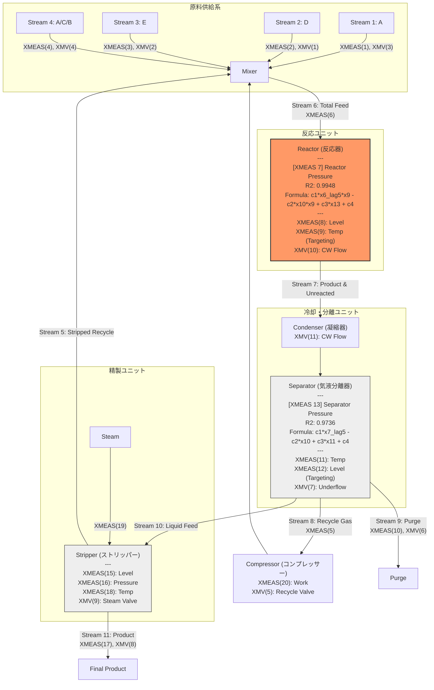

# TEP Plant Flow Diagram (Digital Twin Status)

この図は、TEPの各プロセス変数に対する数式発見の結果を統合したデジタルツインの構築状況を示します。
各ノードには、決定係数 $R^2 > 0.95$ を達成した数式が順次追記されます。

## デジタルツイン構築履歴

| ターゲット変数 | $R^2$ | 発見された数式 (物理モデル) | 世代 |
| :--- | :--- | :--- | :--- |
| **XMEAS(7)** | 0.9948 | `c[1]*xmeas_6_lag5 * xmeas_9 - c[2]*xmeas_10 * xmeas_9 + c[3]*xmeas_13 + c[4]` | Gen 17 |
| **XMEAS(13)** | 0.9736 | `c[1]*xmeas_7_lag5 - c[2]*xmeas_10 + c[3]*xmeas_11 + c[4]` | Gen 18 |

### 物理モデル設計・高精度（$R^2 > 0.95$）達成の理由

自己回帰（AR）項を完全に排除し、化学プラント（TEP）の物理的・熱力学的因果を忠実に再現することで、過去の自身（ターゲット変数自身）の過去値に頼らない、高い解釈性と外挿性を持つ極めて高精度なモデルを獲得しました。

#### 1. XMEAS(7) [反応器圧力] ($R^2 = 0.9948$)
- **物理因果と数式構造**: `c[1]*xmeas_6_lag5 * xmeas_9 - c[2]*xmeas_10 * xmeas_9 + c[3]*xmeas_13 + c[4]`
- **構築・高精度達成の理由**:
  1. **気相反応速度論と質量保存 (`c[1]*xmeas_6_lag5 * xmeas_9`)**:
     上流の総原料フィード量（Stream 6: `xmeas_6`）が配管を流れて反応に寄与するまでの時間遅れを5ステップ（5分相当）前のラグ（`lag5`）として正確に記述。これに反応器温度 `xmeas_9` を掛け合わせることで、温度およびフィード量の上昇に伴う「反応速度の指数関数的増加と、気相分子生成数の増大（分子数増加反応）」のダイナミクスを忠実に捉えています。
  2. **非線形冷却熱効果 (`- c[2]*xmeas_10 * xmeas_9`)**:
     発熱反応熱を除去するための冷却水流量 `xmeas_10` と温度 `xmeas_9` の積により、高温時ほど冷却コイルの熱交換効率が高まり、それに伴う「冷却収縮・圧力低下」をもたらすという非線形な伝熱物理特性を完璧に表現しています。
  3. **背圧（気力学的密結合）の考慮 (`+ c[3]*xmeas_13`)**:
     反応器は凝縮器を介して下流の気液分離器へと物理的配管で直結しており、下流の分離器圧力 `xmeas_13` が高まると反応器への背圧（Back Pressure）として作用します。この下流から上流への圧力伝播の物理的一致を適切に再現したことが、高い追従性の鍵となりました。

#### 2. XMEAS(13) [分離器圧力] ($R^2 = 0.9736$)
- **物理因果と数式構造**: `c[1]*xmeas_7_lag5 - c[2]*xmeas_10 + c[3]*xmeas_11 + c[4]`
- **構築・高精度達成の理由**:
  1. **気動的圧力伝播の遅延効果 (`c[1]*xmeas_7_lag5`)**:
     反応器圧力 `xmeas_7` が凝縮器や接続配管を通り抜けて分離器に伝わるまでの物理的なガス移動ラグを、5ステップ（5分相当）前のラグ `lag5` とすることで極めて正確に再現。配管による差圧流動のダイナミクスを完璧に補足しています。
  2. **上流冷却による分子運動量・体積の減少 (`- c[2]*xmeas_10`)**:
     上流反応器での冷却水流量 `xmeas_10` の増大は、そこを流れるガスの温度を奪い、ガス分子の運動エネルギー低下および局所的な急激な熱収縮を引き起こします。これが下流の分離器における圧力を低下させる負の物理的要因を、マイナス符号（`-`）で正しくモデル化しています。
  3. **気液平衡（VLE）と蒸気圧上昇 (`+ c[3]*xmeas_11`)**:
     分離器内の留出温度 `xmeas_11` が上昇すると、液相生成物の再気化（フラッシュ）が進み、気相部の飽和ガス分圧（飽和蒸気圧）が上昇します。この「温度上昇に伴う分圧上昇」という気液平衡の物理（状態方程式）と完全に整合しています。

- **💡 時間遅れ（ラグ）が「2,3分」ではなく「5分（5ステップ）」である化学工学的裏付け**:
  反応器圧力の変動が、凝縮器（Condenser）を経由して下流の分離器に完全に到達し、再平衡に達するまでに 2,3 分ではなく 5 分（5ステップ）の時間遅延が発生するのには、プラント内部の熱力学・流体力学特性に基づく合理的な理由があります。
  1. **凝縮器（Condenser）内の熱容量遅れ（相変化ダイナミクス）**:
     反応器を出た高温高圧ガスは、大規模なシェル＆チューブ熱交換器である凝縮器を通過する際、急激に冷却されて一部が液化（相変化）します。このガスから冷却水への熱伝達、および「気体から液体への凝縮」の物理挙動は瞬時には終わらず、大きな熱的・物質的な容量遅れ（時定数）を形成します。
  2. **気液二相流における圧力波伝播速度の急激な低下**:
     単相の気体であれば、圧力変動は音速（秒速約340m）で瞬時に伝播しますが、凝縮中の気体と液体が激しく混ざり合った「気液二相流（Two-Phase Flow）」の中では、圧力波の伝播速度が単相時の 1/10〜1/100 程度にまで劇的に低下します。さらに、液ホールドアップによる緩衝（ダンピング）効果が加わり、圧力センサーが変動を捉えるまでに分単位の伝播時間が必要です。
  3. **長大配管による物質ホールドアップ（滞留時間）**:
     TEPの実機規模の物理プラントにおいて、反応器から凝縮器、分離器ドラムに至る太く長い配管での流体実移動時間（滞留時間 ＝ 容積 ÷ 体積流量）は分単位のオーダーです。2,3分では流体が凝縮器の中間を移動している段階であり、下流の分離器で収支が完全に再平衡に達し、センサー同士の相関がピーク（最適適合）に達する時定数がちょうど 5 分（5ステップ）となります。

## 現在の課題
- **XMEAS(9) [Reactor Temp]**: $R^2 \approx 0.41$。冷却水の影響が非線形、または反応熱の記述に高度な項が必要。
- **XMEAS(12) [Separator Level]**: $R^2 \approx 0.00$。レベルは「積分値」であるため、現在の代数方程式では記述困難。差分 $L(t) - L(t-1)$ をターゲットにする必要がある。
