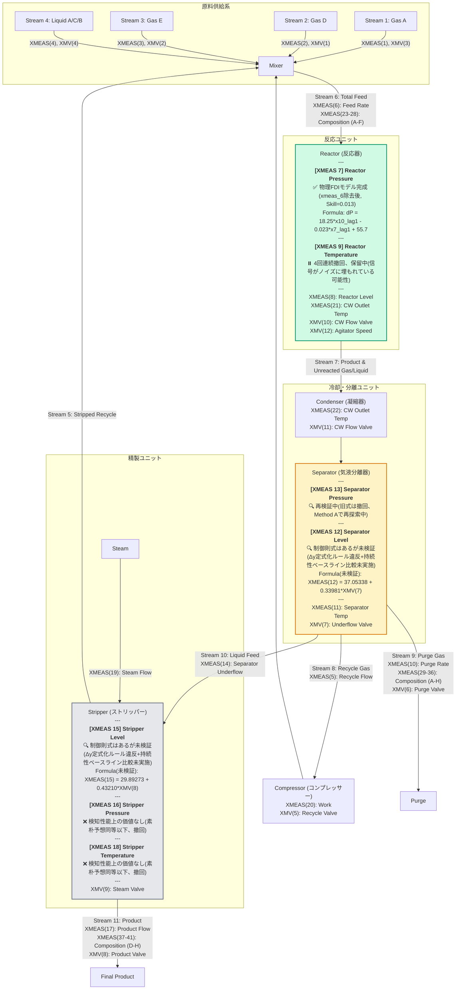

# TEP Plant Flow Diagram (Digital Twin & FDI Status)

この図は、TEPの各プロセス変数に対するモデルベース異常検知（FDI）のための動的因果モデル構築の状況を示します。

**⚠️ 重要な訂正（2026-09-14）**: 「完成判定の必須チェックリスト」(`.kiro/steering/variable-modeling-methodology.md`)を新設し、既存の「完成」モデルを一斉に再監査した結果、**当初「完成」としていたXMEAS(7)/(16)/(18)のうち、検知性能上の付加価値が実証されたのはXMEAS(7)のみ**でした。XMEAS(16)/(18)は、物理法則を一切使わない「素朴な変化量閾値検出器」と同水準かそれ以下の性能しかなく、検知性能上の価値なしとして格下げしました（詳細はセクション3・4）。XMEAS(7)自体も、入力変数`xmeas_6`が閉ループ交絡の疑いが濃く無意味な同乗変数だったため除去し、式を修正しています（詳細はセクション1）。現時点で全対象中「完成」と呼べるのはXMEAS(7)のみです。最新の全体状況は`STATUS_SUMMARY.md`を参照してください。

---

## 🛠️ モデルベースFDI（異常検知）数式構築の仕様と評価

### 1. 反応器圧力変化 $\Delta P_{reactor}(t) = P_{reactor}(t+1) - P_{reactor}(t)$ (同定完了、2026-09-14再監査済み)

#### ⚠️ 2026-09-14の修正: `XMEAS(6)`項の除去

旧式は流入項として$XMEAS(6)$（反応器総フィード流量）を含んでいたが、CCF非対称性検定で比率5.95（閉ループ交絡の疑いが濃厚）と判明。ラン境界・ホールドアウトを正しく扱ったアブレーション検証で、$XMEAS(6)$を除去してもR²・F1が全く変化しないことを確認し、除去した。

#### 🧪 根拠の方程式（物理質量保存と自己減衰の結合）
気相体積 $V$（一定）の反応器において、温度 $T$（XMEAS(9)）がほぼ一定であると仮定すると、圧力変化率 $\frac{dP}{dt}$ は、累積された気相モル数 $n$ の変化率 $\frac{dn}{dt}$（流入モル流量 $F_{in}$ と流出モル流量 $F_{out}$ の差）に比例します：
$$\frac{dP}{dt} \approx \frac{RT}{V} (F_{in} - F_{out})$$

これを離散化し、物理的な**オリフィス流出特性（高圧ほど流出量が増大する負の自己フィードバック）**を線形近似した自己減衰項（$-c_2 \cdot P(t-1)$）を導入して支配方程式を定式化しました。**サンプリング周期は従来「1分」と記載していましたが、データ構造（500ラン×500サンプル）がRieth et al. (2017)の公開TEPベンチマークと一致することから、実際は「3分」である可能性が高いです（未確証）。下記の「lag1」は時間の単位を主張せず、あくまで「1サンプル分」として扱います。**

#### 📝 同定された支配方程式（1-Step Ahead 予測式、ラン境界を尊重したfit/holdout分割で再フィット）
$$\Delta P(t) = 18.24992 \cdot XMEAS(10)_{lag1} - 0.02287 \cdot XMEAS(7)_{lag1} + 55.70274$$

*   **流出項（$18.250 \cdot XMEAS(10)_{lag1}$）**: パージ流量 $XMEAS(10)$。CCF比率1.33(除外閾値2.0未満だが1.0からは離れており「境界線」)。
*   **自己減衰項（$-0.02287 \cdot XMEAS(7)_{lag1}$）**: 反応器圧力自身の高まりにより安定化フィードバックが働き、プロセスの蓄積過渡応答を自律安定化。

#### 📊 正常データ再現性とFDI評価結果（正常全域fit/holdout分割・異常全域 計約525万行、2026-09-14再計算）
*   **R²（絶対値レベル、1ステップ再構成）**: FIT=0.9377、HOLDOUT=0.9358 — ただしこの数字は**素朴な「変化なし」予測(dp=0)でも0.9354相当に達する**ため、単独では式の価値を示しません（後述の必須チェックリスト#6）。
*   **R²（差分スケール、真の説明力）**: **2.8%**
*   **MAE比較（実単位、kPa）**: 素朴予想=1.5281(FIT)/1.5255(HOLDOUT) vs 本モデル=1.5060(FIT)/1.5054(HOLDOUT)
*   **Skill Score**（素朴予想からの改善率）: **0.0145(FIT) / 0.0132(HOLDOUT)** — 小さいが明確に正
*   **誤検知率 (FAR)**: **0.00%**
*   **故障検知率 (F1)**: **0.5624**（素朴予想単独のF1=0.4673を明確に上回る。これが「XMEAS(7)は価値がある」と判定した根拠）

#### 📋 IDVごとのFDR（検知率）

| IDV | FDR | IDV | FDR | IDV | FDR | IDV | FDR |
|:-:|:-:|:-:|:-:|:-:|:-:|:-:|:-:|
| 1 | 15.2% | 6 | **100%** | 11 | 0% | 16 | 0% |
| 2 | **100%** | 7 | **100%** | 12 | **100%** | 17 | 0.4% |
| 3 | 0% | 8 | 74.8% | 13 | 91.4% | 18 | **100%** |
| 4 | 0% | 9 | 0% | 14 | 0.2% | 19 | 0% |
| 5 | 0.4% | 10 | 0% | 15 | 0% | 20 | **100%** |

#### ⚠️ 本モデルの明確な物理限界と主張のスコープ（学術的誠実さ、2026-09-14更新）
本モデルはマスバランスに特化した動的ツインであり、万能の検知ツールではありません。

1.  **主張のスコープ制限**: 質量流入・流出バランスを直接破壊する異常（IDV 2, 6, 7, 12, 13, 18, 20）に限り確実に検知できます。
2.  **検知対象外の故障**: IDV(3,4,9,10,11,15,16,19)はFDR 0%で、本モデルでは検出できません。
3.  **⚠️「マスキング」の実測証拠（2026-09-14発見）**: 入力変数$XMEAS(10)$のCCF比率が1.33と境界線上であることに対応し、**IDV(8)（原料組成のランダム変動）とIDV(17)は、素朴予想単独よりも本モデルのFDRの方が明確に悪い**結果でした(IDV8: 84.2%→74.8%、IDV17: 6.8%→0.4%)。これは、これらの故障が$XMEAS(10)$自体を（おそらく組成変化に伴うモル流量バランスの変化を介して）巻き込んで動かし、圧力の異常を式が「説明」してしまい検知を隠蔽している、というマスキングの直接的な証拠です。**IDV(8)・IDV(17)については、本モデルの使用が単純な閾値検出よりもむしろ有害**であることを正直に記録します。
4.  **プロセス「むだ時間」に伴うタイムラグ**: バルブから圧力計に情報が伝播するまでの物理的な配管流動遅延（むだ時間）に依存した時間遅れが必ず発生します。

---

### 2. 分離器圧力変化 $\Delta P_{separator}(t) = P_{separator}(t+1) - P_{separator}(t)$ (🔍 再検証中 — 旧式は撤回)

#### ⚠️ 撤回の経緯（学術的誠実さのための記録）

以下に記載する式は、2026-08-18時点で「同定完了」として報告されたが、その後の検証で**撤回**された。撤回理由を正直に記録する:

1. **`xmeas_16`アブレーション検証**: 式の主要項をスケーリングしていた`XMEAS(16)`を全項から除去したところ、正常データR²はほぼ変化しなかった（0.9346→0.9308）。一方、IDV(6)の検知率は10.4%→96.4%に劇的改善した。これは`XMEAS(16)`が正常時の説明力にほとんど寄与しておらず、異常時にターゲットへ連動して検知を隠蔽する「相関の罠」を引き起こしていた直接的な証拠である。
2. **係数の符号・大きさの理論値照合**: 残った項（`XMEAS(11)`分離器温度）の係数は、理想気体の状態方程式($\partial P/\partial T=P/T$)が予言する符号・大きさのいずれとも矛盾していた（生相関 r=-0.251、大きさの比 -0.37）。
3. **単一法則コミット＋符号事前照合(Method A)によるLLM-GP再探索**: 質量収支の型に沿った式（`XMEAS(6)`, `XMEAS(10)`, `XMV(5)`, `XMEAS(20)`等の組み合わせ）を複数回試したが、いずれも全データでのOLS再フィット、または符号チェック実装自体の修正後の再照合で符号不整合が判明した。
4. **相互相関関数(CCF)による閉ループ制御交絡の検定**: 差分系列でのCCF非対称性検定により、候補変数のうち`XMV(5)`（非対称性比7.71）と`XMEAS(6)`（同4.20）は、ターゲットの変化に"反応"している側である証拠が強く、独立した物理的driving forceとして扱うこと自体が誤りだった可能性が高いと判明した。

**現状**: 上記の理由により、XMEAS(13)について物理的に妥当と主張できる式は現時点で存在しない。検証手法自体（Method A、符号・大きさ照合、CCF交絡検定）は`.kiro/steering/variable-modeling-methodology.md`に確立済みであり、今後の再探索はこの手法に基づいて行う。

---

#### 📜 撤回された旧式（履歴として保持、根拠として採用不可）

#### 🧪 根拠の方程式（Daltonの分圧法則に基づく質量スケーリング）
分離器気相部の圧力変化は、Daltonの分圧法則（各成分の分圧はその物質量分率と全圧の積に比例する: $p_i \propto x_i \cdot P$）およびエネルギー・質量収支に支配されます。LLM-GPは探索の過程で、温度・組成・圧縮機仕事の各項を単独のモル分率/仕事量として扱うのではなく、共存するストリッパー圧力 $XMEAS(16)$（分離器気相と熱力学的に連結した圧力プロキシ）との積として質量/分圧換算する構造を段階的に発見しました。

#### 📝 同定された支配方程式（1-Step Ahead 予測式、正常データ全域でのOLS再同定）— ⚠️撤回済み、参考記録
$$\Delta P(t) = c_1 \cdot XMEAS(11)_{t-1}\frac{XMEAS(16)_{t-1}}{100} + c_2 \cdot XMEAS(16)_{t-1} - c_3 \cdot XMEAS(20)_{t-1}\left(1-\frac{XMV(5)_{t-1}}{100}\right)^2\frac{XMEAS(16)_{t-1}}{100}$$
$$+ \, c_4 \cdot \left(XMEAS(31)_{t-1}+XMEAS(33)_{t-1}+XMEAS(35)_{t-1}\right)\frac{XMEAS(16)_{t-1}}{100} - c_5 \cdot XMEAS(38)_{t-1}\frac{XMEAS(16)_{t-1}}{100} + c_6 \cdot XMEAS(16)_{t-1}\frac{XMV(5)_{t-1}}{100} + c_7$$

正常データ全域（約25万行）でのOLS再同定係数: $c_1=-0.13498,\ c_2=-0.03297,\ c_3=0.01392,\ c_4=-0.00072,\ c_5=-0.07075,\ c_6=0.03643,\ c_7=326.285$

*   **温度×圧力項（$XMEAS(11) \cdot XMEAS(16)/100$）**: 分離器温度によるフラッシュ蒸発を、共存圧力でスケーリングし質量寄与として表現。
*   **圧縮機引き抜き項（$XMEAS(20) \cdot (1-XMV(5)/100)^2 \cdot XMEAS(16)/100$）**: リサイクルバルブ$XMV(5)$による圧縮機吸込みの内部循環分岐を2乗（バルブ流量特性の非線形性）で補正し、正味の気相引き抜き量として質量換算。
*   **パージ組成分圧項（$(XMEAS(31)+XMEAS(33)+XMEAS(35)) \cdot XMEAS(16)/100$）**: パージガス組成（Component C, E, G）をモル%のまま使わず、共存圧力との積で真の分圧寄与に変換。
*   **製品組成分圧項（$XMEAS(38) \cdot XMEAS(16)/100$）**: 最終製品組成（Component E）の分圧換算。
*   **ストリッパー圧力・バルブ結合項（$XMEAS(16)$, $XMEAS(16) \cdot XMV(5)/100$）**: 下流ストリッパーとの気相連結（背圧）と、リサイクルバルブ開度に依存するその結合強度。
*   反応器圧力 $XMEAS(7)$ は全探索を通じて一貫して除外（相関の罠対策）。

#### 📊 正常データ再現性とFDI評価結果（正常全域・異常全域 計約525万行）— ⚠️撤回済み、参考記録
*   **正常再現度 $R^2$（1ステップ先予測、全データOLS再同定後）**: **0.9346（93.46%）**
*   **検知閾値**: 正常時最大残差の1.25倍として **32.58 kPa** を設定。
*   **故障別検知性能（FDR / 平均検知遅延ADD）**:

| IDV | 検知率 | ADD | IDV | 検知率 | ADD |
| :-: | :-: | :-: | :-: | :-: | :-: |
| 1 | 12.20% | 0分 | 11 | 0.80% | 0分 |
| 2 | 0.00% | — | 12 | 54.20% | 279.2分 |
| 3 | 0.40% | 0分 | 13 | 68.80% | 5.5分 |
| 4 | 0.00% | — | 14 | 74.20% | 0分 |
| 5 | 0.00% | — | 15 | 0.00% | — |
| 6 | 10.40% | 191.4分 | 16 | 0.00% | — |
| **7** | **100.00%** | 0分 | 17 | 0.20% | 0分 |
| 8 | 0.00% | — | **18** | **100.00%** | 120.8分 |
| **9** | **58.00%** | 0分 | 19 | 96.40% | 0分 |
| 10 | 0.00% | — | 20 | 0.00% | — |

#### ⚠️ 本モデルの明確な物理限界と主張のスコープ（学術的誠実さ）— ⚠️本モデル自体が撤回済み、参考記録
本モデルはXMEAS(7)モデルと同様、質量収支・分圧バランスに特化した動的ツインであり、万能の検知ツールではありません。

1.  **主張のスコープ制限**: 確実に検知できるのは、質量流入・流出バランスや分離器気相の分圧構成を直接破壊する異常（IDV 7, 18, 19, 9, 14, 13, 12）に限られます。IDV(2,4,5,8,10,15,16,20)は本モデルの検知対象外です。
2.  **難検知故障**: IDV(3), IDV(11), IDV(17)はXMEAS(7)モデルと同様、検知率1%未満に留まり、本モデルでは実質的に検知不可能です。
3.  **パージ・製品組成変数の限界**: $XMEAS(31), XMEAS(33), XMEAS(35), XMEAS(38)$はクロマトグラフ分析値であり、実プロセスでは数分間隔の離散サンプリング（分析周期）を伴います。本検証はTEPデータセット上の値をそのまま使用しており、実プラント適用時はこの分析遅延を別途考慮する必要があります。
4.  **係数符号の解釈上の注意**: 上記係数はLLM-GPが正規化・サンプリングデータ上で発見した式構造を、正常データ全域・実単位でOLS再同定したものです。式の**構造**（どの変数をどう組み合わせるか）はLLM-GPの探索結果を採用していますが、多重共線性のある回帰変数を含むため、個々の係数の符号を独立した物理的意味として過度に解釈すべきではありません。
