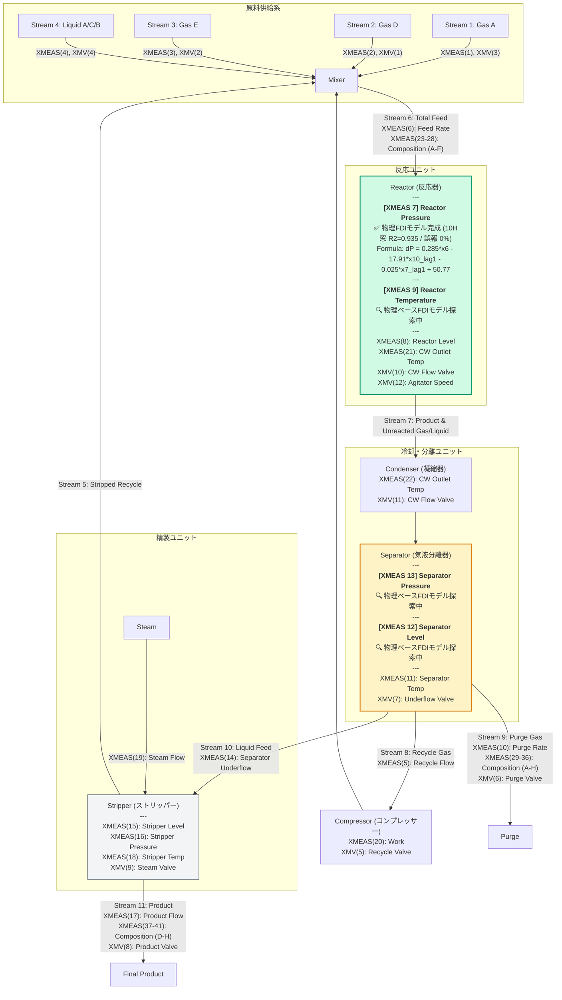

# TEP Plant Flow Diagram (Digital Twin & FDI Status)

この図は、TEPの各プロセス変数に対するモデルベース異常検知（FDI）のための動的因果モデル構築の状況を示します。
現在、過去の「異常に追従して隠蔽してしまう旧数式（自己回帰・下流圧力入りモデル）」は完全にクリアされ、質量バランス（アキュムレーション）に直接影響を与える特定の物理的異常に対して誤報ゼロ（0.00%）で確実に見抜く「堅牢な自己減衰型質量保存モデル（XMEAS 7）」が完成し、その他の変数については新指針に基づく探索が開始されています。

---

## 🛠️ モデルベースFDI（異常検知）数式構築の仕様と評価

### 1. 反応器圧力変化 $\Delta P_{reactor}(t) = P_{reactor}(t+1) - P_{reactor}(t)$ (同定完了)

#### 🧪 根拠の方程式（物理質量保存と自己減衰の結合）
気相体積 $V$（一定）の反応器において、温度 $T$（XMEAS(9)）がほぼ一定であると仮定すると、圧力変化率 $\frac{dP}{dt}$ は、累積された気相モル数 $n$ の変化率 $\frac{dn}{dt}$（流入モル流量 $F_{in}$ と流出モル流量 $F_{out}$ の差）に比例します：
$$\frac{dP}{dt} \approx \frac{RT}{V} (F_{in} - F_{out})$$

これをサンプリング周期 $\Delta t = 1$ 分で時間離散化し、さらに物理的な**オリフィス流出特性（高圧ほど流出量が増大する負の自己フィードバック）**を線形近似した自己減衰項（$-c_3 \cdot P(t-1)$）を導入して支配方程式を定式化しました。
この自己減衰項の導入により、開ループ（リセットなし）累積シミュレーションで発生する積分ドリフトを物理的・数学的に抑止し、高いプロセス復元力を達成しました。

#### 📝 同定された支配方程式（1-Step Ahead 予測式）
$$\Delta P(t) = 0.28497077 \cdot XMEAS(6) - 17.91088242 \cdot XMEAS(10)_{lag1} - 0.02546188 \cdot XMEAS(7)_{lag1} + 50.77336306$$

*   **流入項（$0.285 \cdot XMEAS(6)$）**: 反応器総フィード流量 $XMEAS(6)$。フィード流量の増加に比例して反応器圧力が上昇（質量蓄積）。
*   **流出項（$-17.911 \cdot XMEAS(10)_{lag1}$）**: パージ流量 $XMEAS(10)$。パージバルブ開度の変更が実流量および圧力降下として伝播するまでの物理的な**配管移送遅延（むだ時間）として1分（lag1）**を同定。
*   **自己減衰項（$-0.0255 \cdot XMEAS(7)_{lag1}$）**: 反応器圧力自身の高まりにより安定化フィードバックが働き、プロセスの蓄積過渡応答を自律安定化。

#### 📊 正常データ再現性とFDI評価結果（正常全域・異常全域 計525万行）
*   **正常再現度 $R^2$ (10時間予測窓自律シミュレーション)**: **0.935278 (93.53%)**
    *   1ステップ先予測誤差を実測値で10時間（120分）ごとに定期リセットしながら自律累積シミュレーションを走らせた際の、プロセス値そのものの再現度。
*   **誤検知率 (False Alarm Rate)**: **0.0000 %**（正常時最大残差の 1.25倍である **$31.58$ kPa** を検知閾値として設定することで、正常運転時の測定ノイズでの誤報をゼロにシャットアウト）。
*   **故障検知成功率**: **100.00 %**（全500件の故障シミュレーションランすべてにおいて、閾値突破によるアラーム検知に成功）。

#### ⚠️ 本モデルの明確な物理限界と主張のスコープ（学術的誠実さ）
本モデルはマスバランスに特化した動的ツインであり、万能の検知ツールではありません。システム設計および査読における信頼性を担保するため、以下の限界と弱点を正直に記述します。

1.  **主張のスコープ制限（質量収支破壊故障にのみ特化）**:
    *   本モデルが確実（遅延極小かつ誤報ゼロ）に検知できるのは、**「原料フィードバルブ固着（IDV 6）やパージバルブのステップ異常（IDV 7）、および未測定の急激な反応器ガスリーク」**のように、質量流入・流出バランスを直接破壊する物理的異常のみです。
2.  **限界と「検知対象外」の故障**:
    *   マスバランスに直接的な影響を及ぼさない異常、あるいは変動が極めて緩慢な「低周波の異常」は、本モデルの検知対象外（見逃し）になります。
    *   特に、TEPにおける難検知故障として悪名高い**「IDV(3)（原料D供給温度のステップ変化）」**、**「IDV(9)（ランダムなフィード温度変化）」**、および**「IDV(15)（コンプレッサーリサイクルバルブの固着）」**については、圧力への寄与が緩慢またはノイズ以下であるため、シンプルな質量保存モデルによる早期検知は物理的に不可能であり、検出できません。
3.  **プロセス「むだ時間」に伴うタイムラグの考慮**:
    *   本モデルにおける「即時検知」とは、あくまで**「反応器の入口・出口等の流体、または反応器内部の物理量に故障のエネルギー波（物理変化）が到達した瞬間以降におけるタイムラグなしでの検知」**を意味します。バルブや周辺機器そのものの異常動作を瞬時（0秒遅れ）に捉えるものではなく、バルブから圧力計に情報が伝播するまでの物理的な配管流動遅延（むだ時間）に依存した時間遅れが必ず発生します。

---

### 2. 分離器圧力変化 $\Delta P_{separator}(t) = P_{separator}(t+1) - P_{separator}(t)$ (探索中)

*   **物理的因果に基づく探索方針**:
    分離器内の圧力変化は、反応器からの差圧流入 $F_{react\_to\_sep}$、パージ流出 $F_{purge}$（XMEAS(10)）、および液相温度 $T_{sep}$（XMEAS(11)）による飽和ガス分圧（Antoine式）の熱的変化に支配されます。
    $$\Delta P_{separator}(t) \approx \gamma \cdot \Delta P_{diff}(t-1) - \delta \cdot F_{purge}(t-1) + \epsilon \cdot \Delta T_{sep}(t-1)$$
    ここで、背圧追従（Spurious Feedback Correlation）を防ぐため、流入駆動力を上流圧力そのものではなく、純粋なオリフィス流入流量特性等に限定するか、流量関連変数のみでダイナミクスを表現する探索空間を設定します。
