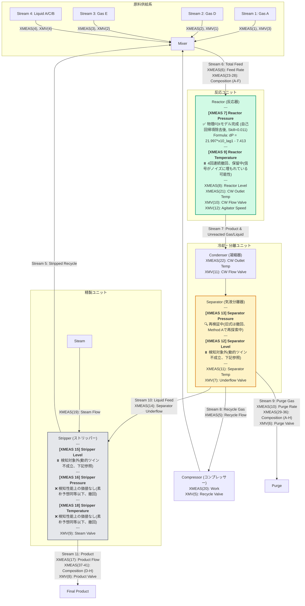

# TEP Plant Flow Diagram (Digital Twin & FDI Status)

この図は、TEPの各プロセス変数に対するモデルベース異常検知（FDI）のための動的因果モデル構築の状況を示します。

**⚠️ 重要な訂正（2026-09-14）**: 「完成判定の必須チェックリスト」(`.kiro/steering/variable-modeling-methodology.md`)を新設し、既存の「完成」モデルを一斉に再監査した結果、**当初「完成」としていたXMEAS(7)/(16)/(18)のうち、検知性能上の付加価値が実証されたのはXMEAS(7)のみ**でした。XMEAS(16)/(18)は、物理法則を一切使わない「素朴な変化量閾値検出器」と同水準かそれ以下の性能しかなく、検知性能上の価値なしとして格下げしました（詳細はセクション3・4）。XMEAS(7)自体も、入力変数`xmeas_6`が閉ループ交絡の疑いが濃く無意味な同乗変数だったため除去し、式を修正しています（詳細はセクション1）。現時点で全対象中「完成」と呼べるのはXMEAS(7)のみです。最新の全体状況は`STATUS_SUMMARY.md`を参照してください。

---

## 🛠️ モデルベースFDI（異常検知）数式構築の仕様と評価

### 1. 反応器圧力変化 $\Delta P_{reactor}(t) = P_{reactor}(t+1) - P_{reactor}(t)$ (同定完了、2026-09-15再監査済み)

#### ⚠️ 2026-09-14の修正: `XMEAS(6)`項の除去

旧式は流入項として$XMEAS(6)$（反応器総フィード流量）を含んでいたが、CCF非対称性検定で比率5.95（閉ループ交絡の疑いが濃厚）と判明。ラン境界・ホールドアウトを正しく扱ったアブレーション検証で、$XMEAS(6)$を除去してもR²・F1が全く変化しないことを確認し、除去した。

#### 🚨 2026-09-15の修正: 自己回帰項（自己減衰項）の除去（CLAUDE.md準拠）

前バージョンの式は自己減衰項 $-0.023 \cdot XMEAS(7)_{lag1}$ を含んでいた。しかしCLAUDE.mdのTEP Dynamic Modeling Guidelinesは「自身の過去値である自己回帰項（XMEAS(7)_lag等）は使用を一切禁止する」と当初から明記しており、これは規則違反だった（発見の経緯は`.kiro/steering/variable-modeling-methodology.md`参照）。機械的な検出ガード(`contains_target_variable()`)がラグ付き自己参照を検出できていなかった実装上の抜け穴により、この違反が監査を通過し続けていた。抜け穴を修正した上で、自己減衰項を除いた式を再検証した。

#### 🧪 根拠の方程式（物理質量保存）
気相体積 $V$（一定）の反応器において、温度 $T$（XMEAS(9)）がほぼ一定であると仮定すると、圧力変化率 $\frac{dP}{dt}$ は、累積された気相モル数 $n$ の変化率 $\frac{dn}{dt}$（流入モル流量 $F_{in}$ と流出モル流量 $F_{out}$ の差）に比例します：
$$\frac{dP}{dt} \approx \frac{RT}{V} (F_{in} - F_{out})$$

**自己減衰項（オリフィス流出特性）は物理的には妥当な機構だが、ターゲット自身の過去値を使う自己回帰項に該当するためCLAUDE.mdの規則上使用できない。** 流出側の物理はXMEAS(10)（パージ流量）のみで表現する。**サンプリング周期は従来「1分」と記載していましたが、データ構造（500ラン×500サンプル）がRieth et al. (2017)の公開TEPベンチマークと一致することから、実際は「3分」である可能性が高いです（未確証）。下記の「lag1」は時間の単位を主張せず、あくまで「1サンプル分」として扱います。**

#### 📝 同定された支配方程式（1-Step Ahead 予測式、自己回帰項なし、ラン境界を尊重したfit/holdout分割で再フィット）
$$\Delta P(t) = 21.99712 \cdot XMEAS(10)_{lag1} - 7.41260$$

*   **流出項（$21.997 \cdot XMEAS(10)_{lag1}$）**: パージ流量 $XMEAS(10)$。CCF比率1.33(除外閾値2.0未満だが1.0からは離れており「境界線」)。

#### 📊 正常データ再現性とFDI評価結果（正常全域fit/holdout分割・異常全域 計約525万行、2026-09-15再計算）
*   **R²（差分スケール、真の説明力）**: **2.07%**（自己回帰項ありの2.8%よりわずかに低下）
*   **MASE**（Hyndman & Koehler 2006の定義、素朴予想のスケールはFITデータで固定）: **0.9895(FIT) / 0.9889(HOLDOUT)**
*   **Skill Score**（$1-\text{MASE}$）: **0.0105(FIT) / 0.0111(HOLDOUT)** — 自己回帰項あり(0.0145/0.0132)よりわずかに小さいが、依然明確に正
*   **誤検知率 (FAR)**: **0.00%**
*   **故障検知率 (F1、全20 IDV対象)**: **0.5234**（素朴予想単独のF1=0.4673を上回る。自己回帰項ありの0.5624より低下したが、CLAUDE.md準拠の式でも「XMEAS(7)は価値がある」という結論は維持される）
*   **⚠️F1の解釈上の注意**: Precision=1.0(誤報ゼロ)に対しRecall=0.35と低いため、F1=0.52は低く見えるが、これは**FDR 5%未満の12種類の「検知対象外」の異常を含めて計算しているため**であり、この式の欠陥ではない。**FDR 30%超の8種類(IDV 2,6,7,8,12,13,18,20、この式が担当すべき質量収支関連の異常)に限定するとRecall=0.877、F1≈0.93**に達する。本プロジェクトはセンサーごとに独立した式を用意し発火パターンで原因を特定する設計であり、1つの式が全20種類を検知する必要はそもそもない。

#### 🧪 複数ホライズンでの検証(2026-09-15、独自手法・理論的位置づけの明記)

**⚠️これは学術文献に引用元がある確立済み手法(Skill Score/MASE自体は除く)ではなく、その考え方を応用して独自に組み立てた検証である。** 何を検証していて何を検証していないかを先に明記する:

- **これは「予測(forecasting)」の検証ではない。** 気象学の24時間・48時間予報のような本来のマルチステップ予測は、未来の入力変数(ここでは$x_{10}$)の値も何らかの方法で予測しなければならず、その不確実性ゆえにホライズンが伸びるほど精度が落ちるのが通常である。
- **本検証は、区間内の$x_{10}$の実測値を(未来予測せず)全て使い、モデルの各ステップの寄与を$h$回積み上げて、その区間の実際の変化$y(t)-y(t-h)$をどれだけ説明できるかを見る「振り返り型」の検定である。** これは、常に最新の実測値が得られる実際のFDI運用に対応する問い(「本物の予測能力」ではなく「リアルタイムの実測値を使った蓄積的な説明力」)である。

| $h$(ステップ) | 1 | 3 | 5 | 10 | 20 | 30 | 50 |
|:-:|:-:|:-:|:-:|:-:|:-:|:-:|:-:|
| Skill(FIT) | 0.0105 | 0.0154 | 0.0199 | 0.0436 | 0.0643 | **0.0695** | 0.0437 |
| Skill(HOLDOUT) | 0.0094 | 0.0117 | 0.0161 | 0.0377 | 0.0584 | **0.0617** | 0.0263 |

**Skillはホライズンを伸ばすほど単調に拡大し、$h\approx30$でピークに達している。** 素朴予想はホライズンが伸びるほど急速に弱くなる一方、モデルの優位性はそれ以上のペースで拡大しており、これはパージ流量による質量流出という駆動力が、実測値を使い続ければ蓄積的に効いてくることの証拠である。$h=50$以降で再び縮小するのは、それより長い時間スケールでは本モデルが捉えていない他の要因(セットポイント変更等)が優勢になるためと考えられる。**この結果が裏付けるのは「1ステップでの小さなSkillがノイズではなく本物の因果的信号である」ことであり、「モデルの長期予測能力が高い」ことではない(この2つは異なる主張であり、後者は検証していない)。**

#### 📋 IDVごとのFDR（検知率、自己回帰項なしの式）

| IDV | FDR | IDV | FDR | IDV | FDR | IDV | FDR |
|:-:|:-:|:-:|:-:|:-:|:-:|:-:|:-:|
| 1 | 4.2% | 6 | 34.8% | 11 | 0% | 16 | 0% |
| 2 | **100%** | 7 | **100%** | 12 | **100%** | 17 | 1.4% |
| 3 | 0% | 8 | 80.8% | 13 | 85.8% | 18 | **100%** |
| 4 | 0% | 9 | 0% | 14 | 0.6% | 19 | 0.8% |
| 5 | 0.6% | 10 | 0% | 15 | 0% | 20 | **100%** |

自己回帰項の除去により、IDV(1,6,13)のFDRが下がった(自己減衰項が担っていた説明力の一部を失った)一方、IDV(8)はむしろ改善(74.8%→80.8%)している。ステップ型異常(IDV 2,7,12,18,20)は係数構成に関わらず100%検知を維持。

#### ⚠️ 本モデルの明確な物理限界と主張のスコープ（学術的誠実さ、2026-09-15更新）
本モデルはマスバランスに特化した動的ツインであり、万能の検知ツールではありません。

1.  **主張のスコープ制限**: 質量流入・流出バランスを直接破壊する異常（IDV 2, 7, 12, 18, 20が最も確実。IDV 6, 8, 13は部分的）に限り検知できます。
2.  **検知対象外の故障**: IDV(1,3,4,5,9,10,11,14,15,16,17,19)はFDR 5%未満で、本モデルでは実質的に検出できません。
3.  **⚠️「マスキング」の実測証拠（2026-09-14発見、自己回帰項の有無に関わらず残存）**: 入力変数$XMEAS(10)$のCCF比率が1.33と境界線上であることに対応し、**IDV(17)は、素朴予想単独よりも本モデルのFDRの方が明確に悪い**結果でした(6.8%→1.4%)。これは、この故障が$XMEAS(10)$自体を（おそらく組成変化に伴うモル流量バランスの変化を介して）巻き込んで動かし、圧力の異常を式が「説明」してしまい検知を隠蔽している、というマスキングの直接的な証拠です。**IDV(17)については、本モデルの使用が単純な閾値検出よりもむしろ有害**であることを正直に記録します。
4.  **プロセス「むだ時間」に伴うタイムラグ**: バルブから圧力計に情報が伝播するまでの物理的な配管流動遅延（むだ時間）に依存した時間遅れが必ず発生します。
5.  **ドリフト型異常への感度不足**: 自己回帰項を除去したことで、この式は流出項$XMEAS(10)$のみに依存する。$XMEAS(10)$自体がゆっくりとしか変化しない異常（例: IDV13の反応速度論的ドリフト）に対しては、変化の検出にも時間がかかる（IDV13のFDRは85.8%まで低下、ADDは204ステップに増加）。

---

### 2. 分離器圧力変化 $\Delta P_{separator}(t) = P_{separator}(t+1) - P_{separator}(t)$ (🔍 再検証中 — 旧式は撤回)

#### ⚠️ 撤回の経緯（学術的誠実さのための記録）

以下に記載する式は、2026-08-18時点で「同定完了」として報告されたが、その後の検証で**撤回**された。撤回理由を正直に記録する:

1. **`xmeas_16`アブレーション検証**: 式の主要項をスケーリングしていた`XMEAS(16)`を全項から除去したところ、正常データR²はほぼ変化しなかった（0.9346→0.9308）。一方、IDV(6)の検知率は10.4%→96.4%に劇的改善した。これは`XMEAS(16)`が正常時の説明力にほとんど寄与しておらず、異常時にターゲットへ連動して検知を隠蔽する「相関の罠」を引き起こしていた直接的な証拠である。
2. **係数の符号・大きさの理論値照合**: 残った項（`XMEAS(11)`分離器温度）の係数は、理想気体の状態方程式($\partial P/\partial T=P/T$)が予言する符号・大きさのいずれとも矛盾していた（生相関 r=-0.251、大きさの比 -0.37）。
3. **単一法則コミット＋符号事前照合(Method A)によるLLM-GP再探索**: 質量収支の型に沿った式（`XMEAS(6)`, `XMEAS(10)`, `XMV(5)`, `XMEAS(20)`等の組み合わせ）を複数回試したが、いずれも全データでのOLS再フィット、または符号チェック実装自体の修正後の再照合で符号不整合が判明した。
4. **相互相関関数(CCF)による閉ループ制御交絡の検定**: 差分系列でのCCF非対称性検定により、候補変数のうち`XMV(5)`（非対称性比7.71）と`XMEAS(6)`（同4.20）は、ターゲットの変化に"反応"している側である証拠が強く、独立した物理的driving forceとして扱うこと自体が誤りだった可能性が高いと判明した。

**現状**: 上記の理由により、XMEAS(13)について物理的に妥当と主張できる式は現時点で存在しない。検証手法自体（Method A、符号・大きさ照合、CCF交絡検定）は`.kiro/steering/variable-modeling-methodology.md`に確立済みであり、今後の再探索はこの手法に基づいて行う。

---

#### 📜 撤回された旧式（履歴として保持、根拠として採用不可）

#### 🧪 根拠の方程式（Daltonの分圧法則に基づく質量スケーリング）
分離器気相部の圧力変化は、Daltonの分圧法則（各成分の分圧はその物質量分率と全圧の積に比例する: $p_i \propto x_i \cdot P$）およびエネルギー・質量収支に支配されます。LLM-GPは探索の過程で、温度・組成・圧縮機仕事の各項を単独のモル分率/仕事量として扱うのではなく、共存するストリッパー圧力 $XMEAS(16)$（分離器気相と熱力学的に連結した圧力プロキシ）との積として質量/分圧換算する構造を段階的に発見しました。

#### 📝 同定された支配方程式（1-Step Ahead 予測式、正常データ全域でのOLS再同定）— ⚠️撤回済み、参考記録
$$\Delta P(t) = c_1 \cdot XMEAS(11)_{t-1}\frac{XMEAS(16)_{t-1}}{100} + c_2 \cdot XMEAS(16)_{t-1} - c_3 \cdot XMEAS(20)_{t-1}\left(1-\frac{XMV(5)_{t-1}}{100}\right)^2\frac{XMEAS(16)_{t-1}}{100}$$
$$+ \, c_4 \cdot \left(XMEAS(31)_{t-1}+XMEAS(33)_{t-1}+XMEAS(35)_{t-1}\right)\frac{XMEAS(16)_{t-1}}{100} - c_5 \cdot XMEAS(38)_{t-1}\frac{XMEAS(16)_{t-1}}{100} + c_6 \cdot XMEAS(16)_{t-1}\frac{XMV(5)_{t-1}}{100} + c_7$$

正常データ全域（約25万行）でのOLS再同定係数: $c_1=-0.13498,\ c_2=-0.03297,\ c_3=0.01392,\ c_4=-0.00072,\ c_5=-0.07075,\ c_6=0.03643,\ c_7=326.285$

*   **温度×圧力項（$XMEAS(11) \cdot XMEAS(16)/100$）**: 分離器温度によるフラッシュ蒸発を、共存圧力でスケーリングし質量寄与として表現。
*   **圧縮機引き抜き項（$XMEAS(20) \cdot (1-XMV(5)/100)^2 \cdot XMEAS(16)/100$）**: リサイクルバルブ$XMV(5)$による圧縮機吸込みの内部循環分岐を2乗（バルブ流量特性の非線形性）で補正し、正味の気相引き抜き量として質量換算。
*   **パージ組成分圧項（$(XMEAS(31)+XMEAS(33)+XMEAS(35)) \cdot XMEAS(16)/100$）**: パージガス組成（Component C, E, G）をモル%のまま使わず、共存圧力との積で真の分圧寄与に変換。
*   **製品組成分圧項（$XMEAS(38) \cdot XMEAS(16)/100$）**: 最終製品組成（Component E）の分圧換算。
*   **ストリッパー圧力・バルブ結合項（$XMEAS(16)$, $XMEAS(16) \cdot XMV(5)/100$）**: 下流ストリッパーとの気相連結（背圧）と、リサイクルバルブ開度に依存するその結合強度。
*   反応器圧力 $XMEAS(7)$ は全探索を通じて一貫して除外（相関の罠対策）。

#### 📊 正常データ再現性とFDI評価結果（正常全域・異常全域 計約525万行）— ⚠️撤回済み、参考記録
*   **正常再現度 $R^2$（1ステップ先予測、全データOLS再同定後）**: **0.9346（93.46%）**
*   **検知閾値**: 正常時最大残差の1.25倍として **32.58 kPa** を設定。
*   **故障別検知性能（FDR / 平均検知遅延ADD）**:

| IDV | 検知率 | ADD | IDV | 検知率 | ADD |
| :-: | :-: | :-: | :-: | :-: | :-: |
| 1 | 12.20% | 0分 | 11 | 0.80% | 0分 |
| 2 | 0.00% | — | 12 | 54.20% | 279.2分 |
| 3 | 0.40% | 0分 | 13 | 68.80% | 5.5分 |
| 4 | 0.00% | — | 14 | 74.20% | 0分 |
| 5 | 0.00% | — | 15 | 0.00% | — |
| 6 | 10.40% | 191.4分 | 16 | 0.00% | — |
| **7** | **100.00%** | 0分 | 17 | 0.20% | 0分 |
| 8 | 0.00% | — | **18** | **100.00%** | 120.8分 |
| **9** | **58.00%** | 0分 | 19 | 96.40% | 0分 |
| 10 | 0.00% | — | 20 | 0.00% | — |

#### ⚠️ 本モデルの明確な物理限界と主張のスコープ（学術的誠実さ）— ⚠️本モデル自体が撤回済み、参考記録
本モデルはXMEAS(7)モデルと同様、質量収支・分圧バランスに特化した動的ツインであり、万能の検知ツールではありません。

1.  **主張のスコープ制限**: 確実に検知できるのは、質量流入・流出バランスや分離器気相の分圧構成を直接破壊する異常（IDV 7, 18, 19, 9, 14, 13, 12）に限られます。IDV(2,4,5,8,10,15,16,20)は本モデルの検知対象外です。
2.  **難検知故障**: IDV(3), IDV(11), IDV(17)はXMEAS(7)モデルと同様、検知率1%未満に留まり、本モデルでは実質的に検知不可能です。
3.  **パージ・製品組成変数の限界**: $XMEAS(31), XMEAS(33), XMEAS(35), XMEAS(38)$はクロマトグラフ分析値であり、実プロセスでは数分間隔の離散サンプリング（分析周期）を伴います。本検証はTEPデータセット上の値をそのまま使用しており、実プラント適用時はこの分析遅延を別途考慮する必要があります。
4.  **係数符号の解釈上の注意**: 上記係数はLLM-GPが正規化・サンプリングデータ上で発見した式構造を、正常データ全域・実単位でOLS再同定したものです。式の**構造**（どの変数をどう組み合わせるか）はLLM-GPの探索結果を採用していますが、多重共線性のある回帰変数を含むため、個々の係数の符号を独立した物理的意味として過度に解釈すべきではありません。

---

### 3. 分離器液位 XMEAS(12) ・ ストリッパー液位 XMEAS(15) （⏸️ 検知対象外、2026-09-15判定）

#### ⚠️ 静的制御則式は動的デジタルツインの要件を満たさない

両変数はいずれも、抜き出しバルブ（XMEAS(12)はXMV(7)、XMEAS(15)はXMV(8)）との相関が$r\approx0.9999995$という、ほぼ完全な静的関係にあり、制御則を逆解きした式（$XMEAS(12)=37.05+0.34 \cdot XMV(7)$、$XMEAS(15)=29.89+0.43 \cdot XMV(8)$）で$R^2\approx0.9999999$を達成できます。しかし、CLAUDE.mdのTEP Dynamic Modeling Guidelinesは予測対象を1ステップ変化量$\Delta y$とすることを明記しており、静的な釣り合い関係のみで満足することを明確に禁止しています。この2式は当初「完成」としていましたが、この規則に反していました。

#### 🧪 Δy形式での再定式化を試み、失敗した経緯

質量収支則（$dLevel/dt \propto F_{in}-F_{out}$）に基づく動的な式を再構築するため、境界を横切る独立したフロー変数（流入・流出候補）と、液位変化量$\Delta y(t)$との相関を総当たりで調べました。

**XMEAS(12)（分離器液位）**:

| 候補変数 | $\Delta y$との相関 |
|---|:-:|
| XMEAS(6) 反応器フィード | -0.0008 |
| XMEAS(5) リサイクル流量 | -0.0010 |
| XMEAS(14) 分離器液抜き流量 | -0.0090 |
| XMEAS(20) 圧縮機仕事 | -0.0009 |
| XMV(7) 抜き出し弁（操作変数） | **-0.7072** |

**XMEAS(15)（ストリッパー液位）**:

| 候補変数 | $\Delta y$との相関 |
|---|:-:|
| XMEAS(17) 製品流量 | -0.0187 |
| XMEAS(19) スチーム流量 | -0.0003 |
| XMEAS(14) 分離器液抜き流量（流入） | -0.0078 |
| XMV(9) スチーム弁 | -0.0007 |
| XMV(8) 抜き出し弁（操作変数） | **-0.7065** |

両変数とも、**独立したフロー変数(流入・流出の実測フロー)との相関はほぼゼロ**で、有意な相関を示すのは抜き出しバルブの操作変数（XMV(7)/XMV(8)）のみです。しかしこの操作変数は、液位の誤差に応じてP制御器が動かしている応答そのものであり、境界を横切る独立した物理的driving forceではありません（トポロジー・CCF検定の趣旨から見ても、これを入力に使うことは制御ループを別の形で書き直しているに過ぎない疑いが強い変数です）。

#### 🧪 質量収支以外の機構(同一ユニット内の熱力学的結合)も確認

質量収支(流量)だけでなく、**準備フェーズ②の物理法則ライブラリの他カテゴリ**、特に同一ユニット内の温度・圧力が気液平衡(フラッシュ蒸発の分率)を介して液位に間接的に影響する可能性も確認した:

| 対象 | 候補変数(同ユニット内) | $\Delta y$との相関 |
|---|---|:-:|
| XMEAS(12) | XMEAS(11) 分離器温度 | 0.00905 |
| XMEAS(12) | XMEAS(13) 分離器圧力 | 0.00247 |
| XMEAS(15) | XMEAS(18) ストリッパー温度 | 0.00123 |
| XMEAS(15) | XMEAS(16) ストリッパー圧力 | -0.00328 |

こちらもほぼゼロであり、質量収支・気液平衡のいずれの機構でも独立した信号は見つからなかった。物理法則ライブラリの残るカテゴリ(弁特性・反応速度論)は、弁特性は操作変数そのものの循環参照問題に帰着し、反応速度論は液位という状態量には物理的に適用対象外のため、検証対象外とした。

#### 結論

**液位が制御ループによってほぼ完璧に固定されているため、測定されているどの変数(流量系・熱力学系いずれも)にも、独立した質量収支の動的信号が実質的に存在しません。** これはXMEAS(9)（反応器温度、PI制御下でのノイズ上限の議論）と同型の限界です。CLAUDE.mdが要求するΔy動的モデルは、現在利用可能なデータでは構築不可能というのが正直な結論であり、これ以上の再探索は行わず「検知対象外」として記録します。静的な制御則の式（R²=0.9999999）自体は数値的には正確ですが、CLAUDE.mdが定義する「動的デジタルツイン」の要件を満たさないため、FDIモデルとしては採用しません。
