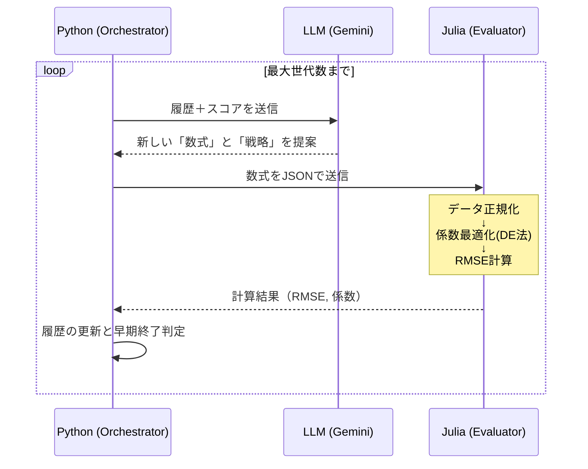

# LLM-GP システム構築成果報告
## LLMとJuliaによる物理法則駆動型シンボリック回帰

---

## 1. プロジェクトの背景と目的

**データ駆動から「法則駆動」へのパラダイムシフト**

- **課題**: 従来の機械学習モデル（深層学習など）はブラックボックス化しやすく、化学プラントのような複雑な系では「物理的解釈（なぜその結果になるのか）」が困難。
- **解決策 (LLM-GP)**: 
  - 大規模言語モデル（LLM）の**推論能力（ドメイン知識）**
  - Juliaの**高速・厳密な数値計算能力**
  これらを融合させ、**説明可能で物理的に妥当な数式（Symbolic Regression）**を自律的に発見するシステムを構築する。

---

## 2. システムアーキテクチャ

**異言語間・疎結合ハイブリッドアーキテクチャ**

- **オーケストレーター (Python)**:
  - 探索履歴の管理と進化ループの制御
  - プロンプトの生成とLLM（Gemini API）へのクエリ送信
- **推論エンジン (LLM)**:
  - 物理法則（Ideal Gas Lawなど）に基づいた数式の提案
  - 失敗履歴からの自律的な戦略修正（Feedback）
- **計算エンジン (Julia)**:
  - TEPデータセット（`.RData`）の読み込みとZ-score正規化
  - 差分進化法（BlackBoxOptim.jl）による係数($c$)の高速最適化
  - 適応度（RMSE＋複雑さペナルティ）の算出

---

## 3. ワークフロー（進化ループ）

---

## 4. 直面した課題と技術的解決

システム構築過程で直面した問題を以下の手法で解決：

1. **LLMの構文エラー（バッククォート・Python構文の混入）**
   👉 **解決**: プロンプトエンジニアリングの強化。Juliaのべき乗（`^`）の強制と、プレーンテキストでの出力ルールの厳格化。
2. **評価関数のタイムアウトと最適化の発散**
   👉 **解決**: Julia側でデータをサンプリングして高速化。また、巨大な誤差に対してはクリッピング（MAEベース）とペナルティを導入し、アルゴリズムが勾配を見失わないよう堅牢化。
3. **異なるスケールの変数による係数調整の困難さ**
   👉 **解決**: 入力データを計算前にZ-scoreで自動正規化。

---

## 5. 実験ハイライト（ターゲット：反応器圧力）

10世代にわたる実験で、LLMは単なるランダム探索ではなく、**「プロセスエンジニア」のような驚異的な推論**を展開しました。

- **Gen 1-2**: 線形モデルから開始し、重要な状態変数を探索。
- **Gen 3-4**: **理想気体の状態方程式（$PV=nRT$）**を自力で導出。
  `c[2]*xmeas_9 * xmeas_8 * (xmeas_1 + xmeas_4)` (温度 × 1/体積 × モル数)
- **Gen 5-7**: 化学反応によるガス消費を考慮し、**アレニウスの式**の形（$\exp(-Ea/RT)$）を組み込む。
- **Gen 8-10**: 直接測れない反応速度を「冷却水の抜熱量」から推測する**ソフトセンサー的アプローチ**を提案し、最終的に攪拌速度（物質移動）まで統合した大統一モデルを作成。

---

## 6. LLMの自律推論の例（Generation 5）

**LLMが実際に出力したフィードバックの要約：**

> 「これまでのモデルは $P \propto nT$ を上手く捉えていましたが、気体の体積($V$)が一定であると誤認していました。実際には、反応器の液位（`xmeas_8`）が上がると気相体積が減り、圧力が非線形に増加します。
> したがって、分母に `(c[3] - xmeas_8)` という体積補正項を導入し、より完全な物理法則に基づいたモデルを提案します。」

→ **人間が介入することなく、失敗から物理的欠陥を見抜き、数式を高度化させることに成功。**

---

## 7. 成果と今後の展望

**【達成された成果】**
- LLMによる高度な物理推論と、Juliaによる高速最適化を連携させた**自律型システム基盤の完成**。
- 例外処理、タイムアウト、データ正規化を備えた実運用に耐えうる堅牢な評価パイプラインの実装。

**【今後の展望】**
- **最適化アルゴリズムの調整**: 現在の複雑な非線形式が数値計算上で発散しやすい問題に対し、係数の初期値制約や損失関数のさらなる平滑化を行う。
- **他データセットへの応用**: TEP以外のオープンデータにも適用し、システムの汎用性を検証する。
